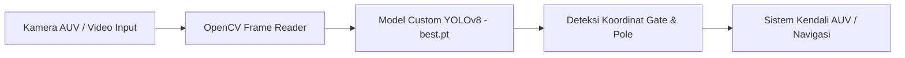
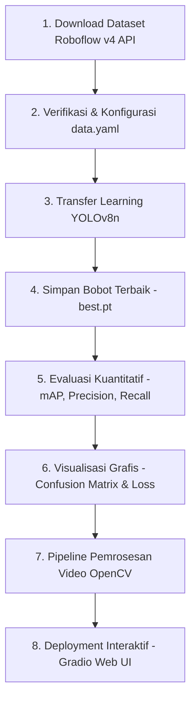
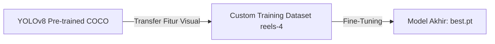
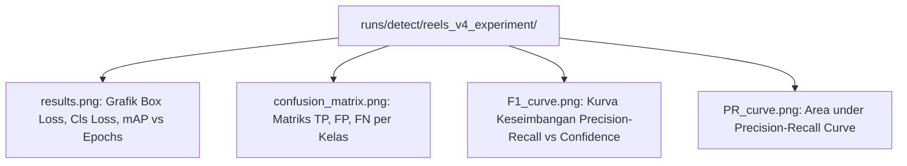
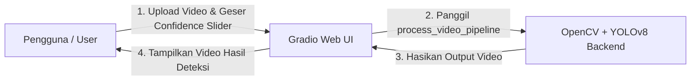

# Week 6: Custom Training YOLOv8, Evaluasi Performa Model, & Interface Video Real-Time

Selamat datang di **Week 6**! Minggu ini kita akan menyelesaikan alur kerja penuh (*end-to-end workflow*) dalam **Computer Vision & Object Detection** kustom. 

Jika pada **Week 5** kita telah mempelajari dasar teori YOLOv8 dan persiapan dataset di Roboflow, maka pada **Week 6** ini kita akan mempraktikkan **Custom Training** menggunakan dataset kustom `reels-moi4j` (versi 4), menganalisis metrik evaluasi model (Precision, Recall, mAP, Loss Curves), hingga membangun **Antarmuka Pemrosesan Video (Video Interface)** yang mampu menjalankan inferensi pada berkas video asli dan *real-time stream*.

---

## 🎯 Tujuan Pembelajaran Modul Ini

Setelah menyelesaikan modul dan notebook **Week 6**, Anda diharapkan dapat:
1. Mengintegrasikan dan mengunduh dataset kustom dari **Roboflow API** (`visionamarine/reels-moi4j` v4) secara terprogram.
2. Melakukan *Transfer Learning / Fine-Tuning* pada model **YOLOv8 Nano** (`yolov8n.pt`) untuk mendeteksi rintangan robot bawah air (*underwater gates*).
3. Memahami dan mengevaluasi metrik performa deteksi objek: **Precision**, **Recall**, **mAP@0.5**, **mAP@0.5:0.95**, **Confusion Matrix**, **F1-Curve**, dan **Loss Curves**.
4. Membangun **Pipeline Pemrosesan Video** berbasis **OpenCV** yang menambahkan anotasi *bounding box*, label kelas, tingkat kepercayaan (*confidence score*), serta menghitung **FPS (Frames Per Second)** secara *real-time*.
5. Mengembangkan **Antarmuka Interaktif (Interactive Video Interface)** menggunakan **Gradio** untuk pengujian video secara independen.

---

## 💡 Mengapa Keterampilan Ini Penting dalam Amarine Vision (AUV)?

Dalam kompetisi robotika laut seperti **Autonomous Underwater Vehicle (AUV)**, robot dituntut untuk dapat bernavigasi secara mandiri melintasi gerbang bawah air (*underwater gates*) tanpa bantuan kendali manusia. 



* **Model Pre-trained COCO** (bawaan YOLOv8) hanya mampu mengenali objek umum seperti mobil, manusia, anjing, atau bus. Model standar tidak tahu apa itu *underwater gate*, *pole gate*, atau *upper gate*.
* **Custom Training** memungkinkan kita mengajari AI untuk mengenali struktur spesifik robotika laut.
* **Video Processing & Real-Time Inferencing** adalah bentuk penerapan nyata di mana AI membaca *video feed* dari kamera AUV dan menghasilkan koordinat objek secara kontinu untuk diproses oleh algoritma navigasi robot.

---

## 🔄 End-to-End Workflow Week 6

Alur kerja keseluruhan pada modul Week 6 digambarkan melalui diagram berikut:



---

## 1. Integrasi Dataset Roboflow (`reels-moi4j` v4)

Pada Week 6 ini, kita menggunakan dataset versi 4 dari project Roboflow **`reels-moi4j`** di workspace **`visionamarine`**.

### Kode Pengunduhan Dataset
```python
from roboflow import Roboflow

# Inisialisasi Roboflow dengan API Key
rf = Roboflow(api_key="q294SmqNM6eLolt7AeUe")
project = rf.workspace("visionamarine").project("reels-moi4j")
version = project.version(4)

# Download dataset format yolov8
dataset = version.download("yolov8")
```

### Struktur Folder Dataset & Penyesuaian `data.yaml`
Dataset yang diunduh memiliki struktur sebagai berikut:
```text
reels-4/
├── data.yaml                 # File konfigurasi dataset YOLO
├── train/                    # Data Pelatihan
│   ├── images/               # Berkas Gambar (.jpg / .png)
│   └── labels/               # Berkas Anotasi (.txt)
├── valid/                    # Data Validasi
│   ├── images/
│   └── labels/
└── test/                     # Data Pengujian Independen
    ├── images/
    └── labels/
```

Isi dari `data.yaml` memuat 4 kelas target deteksi:
```yaml
path: /path/to/reels-4
train: train/images
val: valid/images
test: test/images

nc: 4
names: ['gate', 'pole_gate', 'upper_gate', 'upper_left_gate']
```

---

## 2. Teori & Implementasi Custom Training YOLOv8

### Konsep Transfer Learning
Diberikan dataset bawah air yang jumlah gambarnya terbatas, melatih *Neural Network* dari nol (*scratch*) memerlukan ribuan gambar dan waktu komputasi yang sangat lama. Oleh karena itu, kita menerapkan **Transfer Learning**:
1. Kita menggunakan **bobot awal (*pre-trained weights*)** dari `yolov8n.pt` yang telah terlatih memahami pola visual dasar (garis, tekstur, bentuk) dari jutaan gambar COCO.
2. Kita melatih ulang (*fine-tune*) lapisan *detection head* YOLOv8 agar mengenali fitur spesifik 4 kelas gerbang bawah air kita.



### Fungsi Kerugian (Loss Functions) pada YOLOv8
Selama proses pelatihan, YOLOv8 mengoptimalkan 3 komponen *loss function* utama:

1. **CIoU Loss (Complete Intersection over Union Loss)**:
   Mengukur seberapa akurat koordinat *bounding box* memprediksi lokasi objek asli dengan memperhitungkan *overlap area*, jarak titik pusat (*center distance*), dan rasio aspek (*aspect ratio*).
   $$\text{CIoU} = \text{IoU} - \left( \frac{\rho^2(b, b^{gt})}{c^2} + \alpha v \right)$$

2. **DFL (Distribution Focal Loss)**:
   Membantu model memprediksi batas-batas kotak (*box boundaries*) secara lebih presisi ketika bentuk objek fleksibel atau kabur akibat kekeruhan air.

3. **BCE Loss (Binary Cross Entropy Loss)**:
   Digunakan untuk mengukur kesalahan klasifikasi (*class probability loss*) pada setiap sel grid.

### Eksekusi Kode Pelatihan (Python API)
```python
from ultralytics import YOLO

# Load model pre-trained nano
model = YOLO('yolov8n.pt')

# Training model pada dataset kustom
results = model.train(
    data='reels-4/data.yaml',
    epochs=25,
    imgsz=640,
    batch=16,
    name='reels_v4_experiment',
    plots=True
)
```

---

## 3. Bedah Metrik Evaluasi Performa Model

Setelah pelatihan selesai, bobot terbaik disimpan secara otomatis pada `runs/detect/reels_v4_experiment/weights/best.pt`. Untuk memastikan model layak digunakan pada robot AUV, kita melakukan evaluasi kuantitatif.

```python
# Evaluasi Validasi
best_model = YOLO('runs/detect/reels_v4_experiment/weights/best.pt')
metrics = best_model.val(data='reels-4/data.yaml')
```

### Penjelasan Metrik Utama:

| Metrik | Rumus / Definis | Penjelasan Praktis |
| :--- | :--- | :--- |
| **Precision (P)** | $\frac{TP}{TP + FP}$ | Dari seluruh deteksi yang diprediksi AI sebagai gerbang, berapa persen yang **benar-benar gerbang asli**? (Mengukur kehati-hatian AI agar tidak terjadi *false alarm*). |
| **Recall (R)** | $\frac{TP}{TP + FN}$ | Dari seluruh gerbang asli yang ada di dalam air, berapa persen yang **berhasil ditemukan** oleh AI? (Mengukur kelengkapan deteksi AI). |
| **mAP@0.5** | Mean Average Precision pada IoU 0.50 | Rata-rata presisi di seluruh kelas ketika kotak deteksi menutupi minimal 50% dari objek asli. Merupakan tolok ukur standar kecepatan & akurasi umum. |
| **mAP@0.5:0.95** | Rata-rata mAP dari IoU 0.50 hingga 0.95 (step 0.05) | Tolok ukur ketat (*strict evaluation*). Mengukur seberapa presisi kotak pembatas dibuat oleh AI pada berbagai tingkat keketatan IoU. |

### Visualisasi Grafik Pelatihan & Matriks Konfusi



1. **Confusion Matrix**: Menunjukkan apakah ada kesalahan klasifikasi antar kelas (misalnya `pole_gate` dikira `gate`).
2. **Results.png**: Memastikan *Training Loss* dan *Validation Loss* terus menurun tanpa mengalami *overfitting* (yaitu ketika Val Loss melonjak naik sementara Train Loss terus turun).

---

## 4. Pipeline Pemrosesan Video Asli (OpenCV Integration)

Pada aplikasi lapangan, input yang diterima oleh AUV bukanlah gambar statis melainkan *stream video* berkecepatan 30-60 FPS. Kita membutuhkan fungsi Python menggunakan OpenCV yang memproses video frame-by-frame.

### Arsitektur Pipeline Video OpenCV
1. **Buka Stream Video**: Membaca berkas video input menggunakan `cv.VideoCapture()`.
2. **Inisialisasi VideoWriter**: Menyiapkan format codec (`mp4v`), resolusi frame, dan FPS target untuk menyimpan berkas video hasil.
3. **Looping Frame-by-Frame**:
   - Ambil frame tunggal dari video.
   - Umpankan frame ke `model(frame, conf=0.25)`.
   - Rendernya visual anotasi menggunakan `results[0].plot()`.
   - Hitung durasi inferensi untuk mengkalkulasi nilai **FPS Real-time**.
   - Tambahkan teks FPS pada frame menggunakan `cv.putText()`.
   - Tulis frame hasil anotasi ke dalam berkas `out.write(annotated_frame)`.
4. **Release Memory**: Menutup stream video dan menyimpan berkas keluaran secara bersih.

### Snippet Kode Pipeline Pemrosesan Video:
```python
import cv2 as cv
import time
from ultralytics import YOLO

def process_video_pipeline(input_video_path, output_video_path, model_path='best.pt', conf_thresh=0.3):
    model = YOLO(model_path)
    cap = cv.VideoCapture(input_video_path)
    
    width = int(cap.get(cv.CAP_PROP_FRAME_WIDTH))
    height = int(cap.get(cv.CAP_PROP_FRAME_HEIGHT))
    fps_in = cap.get(cv.CAP_PROP_FPS)
    
    fourcc = cv.VideoWriter_fourcc(*'mp4v')
    out = cv.VideoWriter(output_video_path, fourcc, fps_in, (width, height))
    
    while cap.isOpened():
        ret, frame = cap.read()
        if not ret:
            break
            
        t_start = time.time()
        results = model(frame, conf=conf_thresh, verbose=False)
        annotated_frame = results[0].plot()
        
        # Hitung FPS
        fps = 1.0 / (time.time() - t_start)
        cv.putText(annotated_frame, f"FPS: {fps:.1f}", (20, 50), 
                   cv.FONT_HERSHEY_SIMPLEX, 1.0, (0, 255, 0), 2)
        
        out.write(annotated_frame)
        
    cap.release()
    out.release()
    print("Pemrosesan video selesai!")
```

---

## 5. Interface Pemrosesan Video Interaktif (Gradio Web UI)

Untuk mempermudah pengujian oleh pengguna tanpa perlu mengubah baris kode secara manual, kita membangun **Antarmuka Web Interaktif** menggunakan framework **Gradio**.



### Implementasi Kode Gradio Interface:
```python
import gradio as gr

def gradio_predict_video(video_file, conf_threshold):
    if video_file is None:
        return None
    output_path = "gradio_output_detected.mp4"
    process_video_pipeline(video_file, output_path, conf_thresh=conf_threshold)
    return output_path

demo = gr.Interface(
    fn=gradio_predict_video,
    inputs=[
        gr.Video(label="Unggah Video Input (Underwater / Amarine Vision)"),
        gr.Slider(minimum=0.1, maximum=1.0, value=0.25, step=0.05, label="Confidence Threshold")
    ],
    outputs=gr.Video(label="Video Hasil Deteksi YOLOv8"),
    title="🚀 Amarine Vision - Custom YOLOv8 Video Detection Interface",
    description="Unggah berkas video Anda untuk menguji performa model kustom YOLOv8 (reels-moi4j v4) secara interaktif.",
    theme="soft"
)

demo.launch(inbrowser=True)
```

---

## 🌊 Tips & Best Practices Deteksi Objek Bawah Air (Marine Vision)

Melakukan deteksi objek di lingkungan bawah air (*underwater*) memiliki tantangan unik dibandingkan deteksi darat standar:

1. **Kekeruhan & Partikel Terapung (Water Turbidity / Marine Snow)**:
   * *Solusi*: Lakukan augmentasi data pada Roboflow seperti *Blur*, *Noise*, dan *Hue/Saturation Adjustment* agar model terbiasa dengan pembiasan warna air laut.
2. **Pencahayaan Minim & Absorpsi Warna Merah**:
   * Air menyerap spektrum cahaya merah dengan cepat seiring bertambahnya kedalaman.
   * *Solusi*: Saat preprocessing dengan OpenCV, terapkan teknik **CLAHE (Contrast Limited Adaptive Histogram Equalization)** atau konversi ruang warna ke **HSV / LAB** untuk memperjelas kontras tepi objek sebelum diinferensi.
3. **Fluktuasi Confidence Threshold**:
   * Di bawah air yang sangat tenang, *confidence threshold* $0.3 - 0.4$ aman digunakan.
   * Namun jika air sangat keruh, gunakan *confidence threshold* lebih rendah ($0.2$) yang dikombinasikan dengan algoritma pelacakan objek (*Object Tracking* seperti **ByteTrack** atau **BoT-SORT**) agar deteksi tidak terputus-putus (*flickering*).

---

## 📁 Berkas Modul Week 6

Di dalam direktori `week6/`, terdapat berkas-berkas berikut:
- **`README.md`**: Dokumentasi teori, metrik evaluasi, dan panduan pipeline video ini.
- **`yolov8_custom_training.ipynb`**: Notebook Jupyter interaktif yang memuat seluruh langkah kode dari download Roboflow, training, evaluasi, hingga aplikasi Gradio.

---

## 🚀 Langkah Selanjutnya
Setelah menguasai **Week 6**, Anda telah memiliki fondasi lengkap dalam *custom training* dan *video inference*. Pada modul mendatang, kita akan mengeksplorasi **ROS 2 Integration (Robot Operating System)** untuk menghubungkan hasil deteksi YOLOv8 langsung ke aktuator motor thruster AUV!
